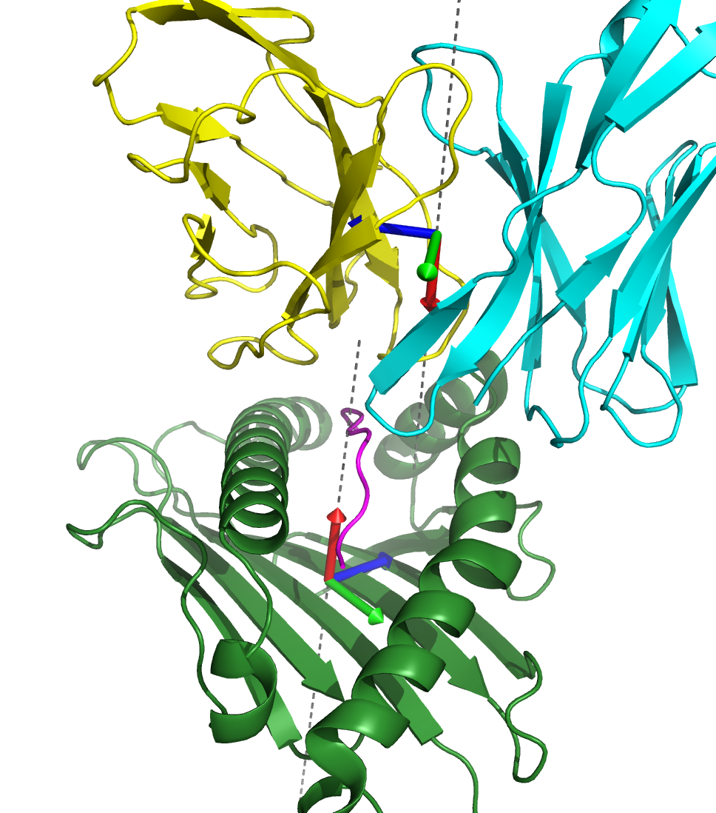
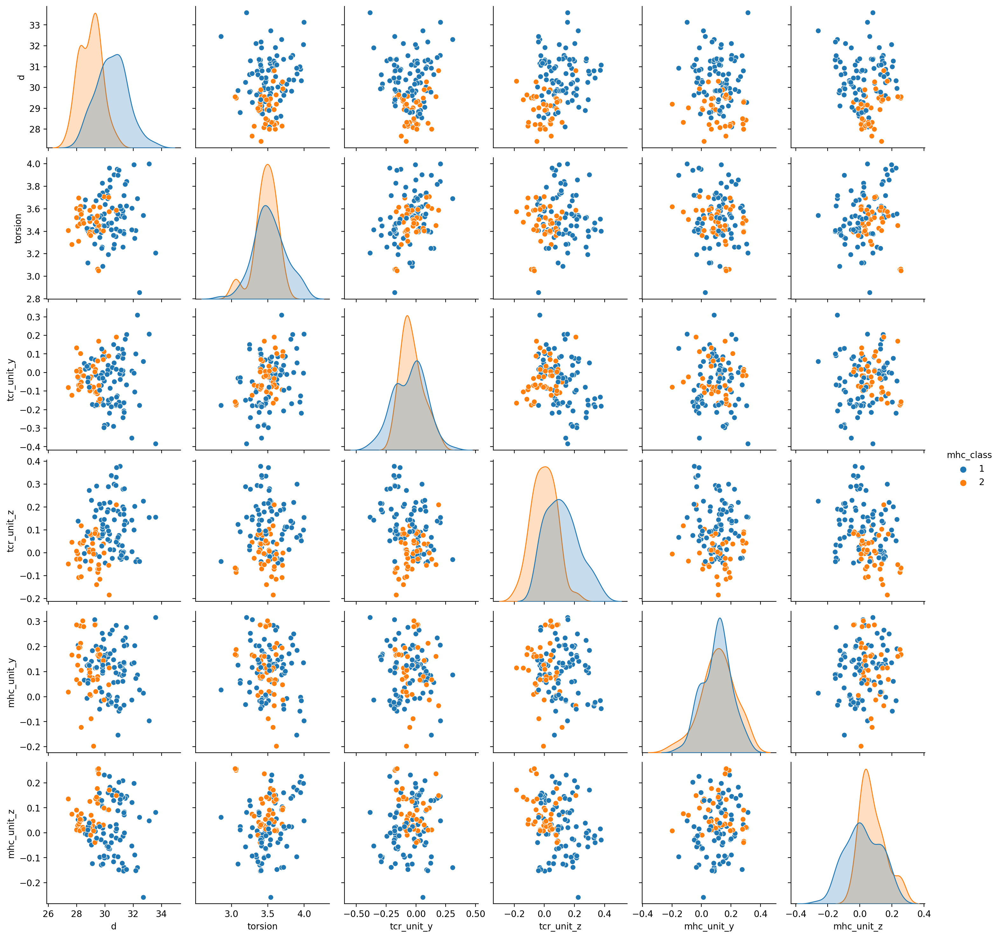

# TCRdock

Python tools for TCR:peptide-MHC modeling and analysis

# Core functionality

* Set up and run TCR-specialized AlphaFold simulations starting from a TSV file with
TCR, peptide, and MHC information.
* Parse a TCR:peptide-MHC ternary PDB structure and define V/J/CDR3, MHC allele, TCR
and MHC coordinate frames, and TCR:pMHC docking geometry
* Calculate distances between docking geometries ('docking RMSDs') for use in clustering/docking analysis and model evaluation.

This functionality is made available in a Python package (`tcrdock`) and through
wrapper scripts as illustrated in the examples below.
The `tcrdock` package includes a subset of the
TCRdist library as a submodule (`tcrdock/tcrdist`) for use during the AlphaFold
setup process. Refer to the source of the `compute_tcrdists.py` script for a
simple use case.

**NOTE: Input and output sequence/residue numbers are 0-indexed**:
they start at 0 and run
through N-1, where N is the length of the sequence. For example, the MHC and TCR
core positions written out by `parse_tcr_pmhc_pdbfile.py` are 0-indexed with
respect to the full ternary sequence.

# Examples

Running any of these Python scripts with the `-h` flag should print a help mesage.

## Parse a TCR:peptide-MHC ternary structure PDB file

The PDB file should just contain a single copy of the ternary structure, with the
following chains (in order)

MHC-I:    (1) MHC, (2) beta-2 microglobulin, (3) peptide, (4) TCRA, (5) TCRB

or MHC-I: (1) MHC, (2) peptide, (3) TCRA, (4) TCRB

MHC-II:   (1) MHCA, (2) MHCB, (3) peptide, (4) TCRA, (5) TCRB

If you run into trouble, it's not a bad idea to "clean" the pdb file by removing
extraneous ligands/waters/etc.

```
python parse_tcr_pmhc_pdbfile.py --pdbfiles examples/parsing/1qsf.pdb \
    --organism human --mhc_class 1 --out_tsvfile parse_output.tsv
```

## Set up for AlphaFold modeling a set of TCR:pMHC complexes

```
python setup_for_alphafold.py --targets_tsvfile examples/benchmark/single_target.tsv \
    --output_dir test_setup_single
```

or

```
python setup_for_alphafold.py --targets_tsvfile examples/benchmark/full_benchmark.tsv \
    --output_dir test_setup_full_benchmark --benchmark
```

Here the `--benchmark` flag tells the script to exclude nearby templates.


## Run AlphaFold modeling using outputs from the above setup

Here `$ALPHAFOLD_DATA_DIR` should point to a folder that contains the AlphaFold
`params/` folder.

This will use the very-slightly-modified version of the `alphafold` library included
with this repository (see `changes_to_alphafold.txt`). It should also run OK
with any post-Nov 2021 version of
`alphafold`, but it may not be as efficient (length changes in the targets list
will trigger recompilation of the model). You will need to run in a Python environment
that has the packages required by alphafold (or in the alphafold docker instance).
If you have an older (pre-multimer) version of alphafold, try changing the variable
`NEW_ALPHAFOLD` to `False` at the top of `predict_utils.py`.

```
python run_prediction.py --targets test_setup_single/targets.tsv \
    --outfile_prefix test_run_single --model_names model_2_ptm \
    --data_dir $ALPHAFOLD_DATA_DIR
```

or

```
python run_prediction.py --targets test_setup_full_benchmark/targets.tsv \
    --outfile_prefix test_run_full --model_names model_2_ptm \
    --data_dir $ALPHAFOLD_DATA_DIR
```

## Compute docking RMSDs from a TSV file with docking geometry info

This will compute the matrix of docking RMSDs among the 220 ternary TCR:pMHC complex
structures in the current template database using the info stored in the file
`tcrdock/db/ternary_templates_v2.tsv`.

```
python compute_docking_rmsds.py --docking_geometries_tsvfile tcrdock/db/ternary_templates_v2.tsv \
    --outfile rmsds.txt
```

## Compute pairwise `TCRdist` values for a set of paired TCRs

This will compute the matrix of paired `TCRdist` values and save it to a text file.
It will also print out the `TCRdiv` repertoire diversity measure calculated
with the sigma from the command line flag `--tcrdiv_sigma` (the default is 120)

```
python compute_tcrdists.py --tcrs_tsvfile examples/tcrdist/human_tcrs.tsv \
    --organism human --outfile tcrdists.txt
```

# Installation

The non-AlphaFold Python package requirements are listed in `requirements.txt`.
Those specific
package versions should work, but there should also be plenty of flexibility on the
versions. The TCR and MHC parsing code also requires the NCBI BLAST+ software
to be installed, which can be done by running the script
`download_blast.py`. A potential installation route would be:

```
conda create --name tcrdock_test python=3.8
source activate tcrdock_test   # or: conda activate tcrdock_test
pip3 install -r requirements.txt
python download_blast.py
```

To run the AlphaFold simulations, you will need a Python environment that satisfies
additional requirements as explained further in the AlphaFold
[README](https://github.com/deepmind/alphafold/blob/main/README.md). One option
would be to use the AlphaFold Docker container.

# File formats and other details

## Docking geometries



TCR:pMHC docking geometries represent the coordinate transformation between
the MHC and TCR reference frames, which are shown as red (X-axis), green (Y-axis), and
blue (Z-axis) arrow triplets in the above TCR:peptide-MHC structure. The
`tcrdock.docking_geometry.DockingGeometry` class defined in
`tcrdock/docking_geometry.py` stores docking geometry information.
Docking geometries are represented (internally and in parsing output)
by 6 numbers and two booleans. The exact choice of which 6 numbers to use to
represent this rigid body transformation is guided by the fact that
the MHC X-axis points up toward the peptide and toward the "canonical"
TCR location, and the TCR X-axis points from near the TCR center of mass
along the TCRA/TCRB symmetry axis toward the CDR3 loops and toward the
"canonical" MHC location (see red arrows in image above).

The docking geometry parameters are as follows (see below for scatterplots):

* d: the distance in Angstroms between the MHC and TCR coordinate frame origins.

* torsion: the dihedral angle in radians between the MHC Y-axis and the TCR Z-axis,
(typically around pi). Takes values in the interval [0,2*pi)

* tcr_unit_y: The Y-component of the unit vector that points from MHC to TCR, in the
MHC frame. In other words, this is the location of the TCR, written in the MHC
coordinate frame, normalized to have length 1. This vector is usually pretty close
to the X-axis vector, since the X-axis of the MHC frame points up from the beta sheet
center toward the peptide, and is perpendicular to the beta sheet.

* tcr_unit_z: The Z-component of the unit vector that points from MHC to TCR, in the
MHC frame.

* mhc_unit_y: The Y-component of the unit vector that points from TCR to MHC, in the
TCR frame. In other words, this is the location of the MHC, written in the TCR
coordinate frame, normalized to have length 1. This vector is usually pretty close
to the X-axis vector, since the X-axis of the TCR frame points along the TCRA/TCRB
symmetry axis toward the CDR3 loops.

* mhc_unit_z: The Z-component of the unit vector that points from TCR to MHC, in the
TCR frame.

* tcr_unit_x_is_negative: boolean that tells whether the MHC--->TCR unit vector
has a negative
x-component. This is always `False` for canonical docking geometries.
It would be `True` if the
TCR is docking to the underside of the MHC beta sheet, or if the peptide is
underneath the beta sheet (ie, whenever TCR and peptide are on opposite sides
of the MHC beta sheet).

* mhc_unit_x_is_negative: boolean that tells whether the TCR--->MHC unit vector
has a negative x-component. This is always `False` for canonical docking geometries.
It would be `True` if the TCR CDR3 loops are pointing away from the MHC, for example
if the TCR is interacting with the MHC via the constant domain.

To see the details of the calculation, refer to the `DockingGeometry.from_stubs`
function. Currently it's here:
https://github.com/phbradley/TCRdock/blob/main/tcrdock/docking_geometry.py#L47

Here are some scatter plots of docking geometry parameters for the 130 ternary
structures in the TCR structure prediction benchmark.



## AlphaFold modeling

The input TSV file for the `setup_for_alphafold.py` script should have the 10 columns
organism, mhc_class, mhc, peptide, va, ja, cdr3a, vb, jb, cdr3b

More explanation can be found by running `python setup_for_alphfold.py -h`

The format of the targets and alignments files created by the `setup_for_alphafold.py`
script and read by the `run_prediction.py` script are explained in the
[README](https://github.com/phbradley/alphafold_finetune/blob/main/README.md) for
the `alphafold_finetune` repository (from which that script is borrowed).


